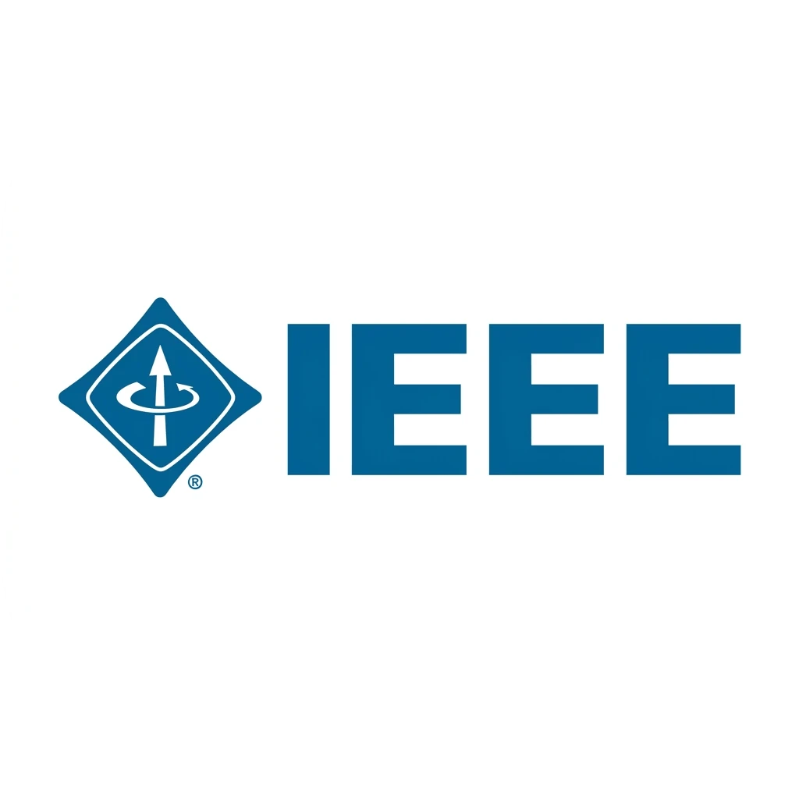

# Hallo!
I'm a Frontend Developer and I'm learning Neovim :)

## Who am I?
A Computer Science Grad. I started programming in 2022 with C++, learning the fundamentals through simple console applications, learning how software works from the ground up. Over time as I explored different areas of software development, I found myself drawn to frontend development where I could combine technical problem-solving with thoughtful user experiences. Today, that's where I spend most of my time.

I'm interested in products that people actually use. Most of my experience comes from building products rather than isolated features.
I enjoy taking ideas from requirements to implementation, collaborating with designers and backend developers, and refining the details until the experience feels right.

For me, It's understanding how people use a product and writing code that's easy for the next developer to understand.

## Experience & Communities

  

  

  

  
  
  
  
  

## Tech Stack

## Let's Talk

- 💼 **LinkedIn**: [abdallah-m-aziz](https://linkedin.com/in/abdallah-m-aziz)
- 🌐 **Portfolio**: [abdallah-aziz.onrender.com](https://abdallah-aziz.onrender.com)

## GitHub Stats

  
  

  

<!--

|   | A | B | C | D | E | F | G | H |
| - | - | - | - | - | - | - | - | - |
| 8 |  |  |  |  |  |  |  |  |
| 7 |  |  |  |  |  |  |  |  |
| 6 |  |  |  |  |  |  |  |  |
| 5 |  |  |  |  |  |  |  |  |
| 4 |  |  |  |  |  |  |  |  |
| 3 |  |  |  |  |  |  |  |  |
| 2 |  |  |  |  |  |  |  |  |
| 1 |  |  |  |  |  |  |  |  |

## Play again? 

**How this works**

When you click a link, it opens a GitHub Issue with the required pre-populated text. Just push "Create New Issue". That will trigger a [GitHub Actions](https://github.blog/2020-07-03-github-action-hero-casey-lee/#getting-started-with-github-actions) workflow that'll update my GitHub Profile _README.md_ with the new state of the board.

-->
